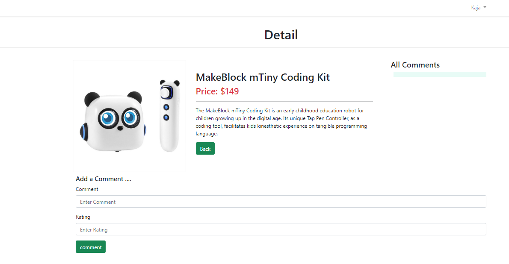

# BIT_Sprint9_Laravel_MVC_SSR

## Requirements

 - Development of an information system using Laravel MVC (SSR).
 - CRUD app
 - Admin area and login system

## Page example

Home

Shop

Product

Admin panel

## Technologies

Project is created with:
* Laravel 9.x
* Laravel UI
* Bootstrap v5.2
* Tailwind UI

# Getting started
## Installation 

Clone the repository
    `git clone https://github.com/Jovita113/BIT_Sprint9_Laravel_MVC-SSR-.git`

Switch to the repo folder

    cd BIT_Sprint9_Laravel_MVC-SSR-

Install all the dependencies using composer

    composer install

Copy the example env file and make the required configuration changes in the .env file

    cp .env.example .env

Run the database migrations (**Set the database connection in .env before migrating**)

    php artisan migrate

Start the local development server

    php artisan serve

You can now access the server at http://127.0.0.1:8000

## Database seeding

Run the database seeder and you're done

    php artisan db:seed

***Note*** : It's recommended to have a clean database before seeding. You can refresh your migrations at any point to clean the database by running the following command

    php artisan migrate:refresh
    
## Environment variables

- `.env` - Environment variables can be set in this file

***Note*** : You can quickly set the database information and other variables in this file and have the application fully working.

# Authentication

This applications uses Laravel UI to handle authentication. (with roles)
## Contact

Created by Jovita! Feel free to contact me! [LinkedIn](https://linkedin.com/in/jovita-s-496773219)
